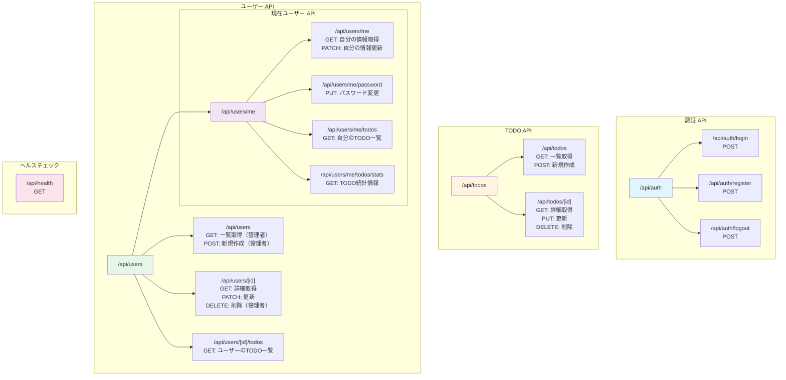
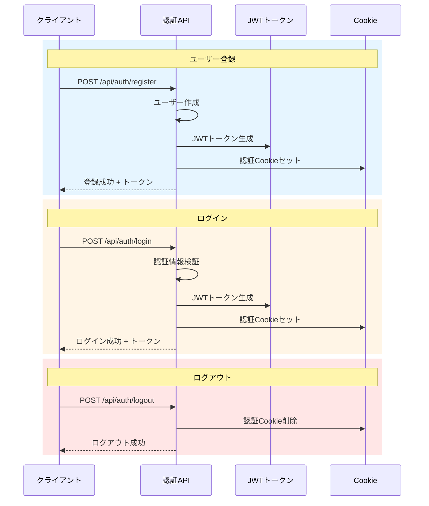
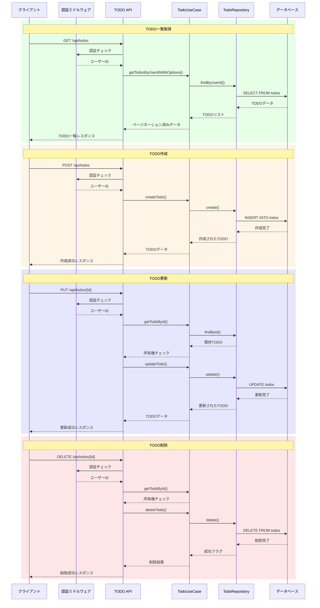
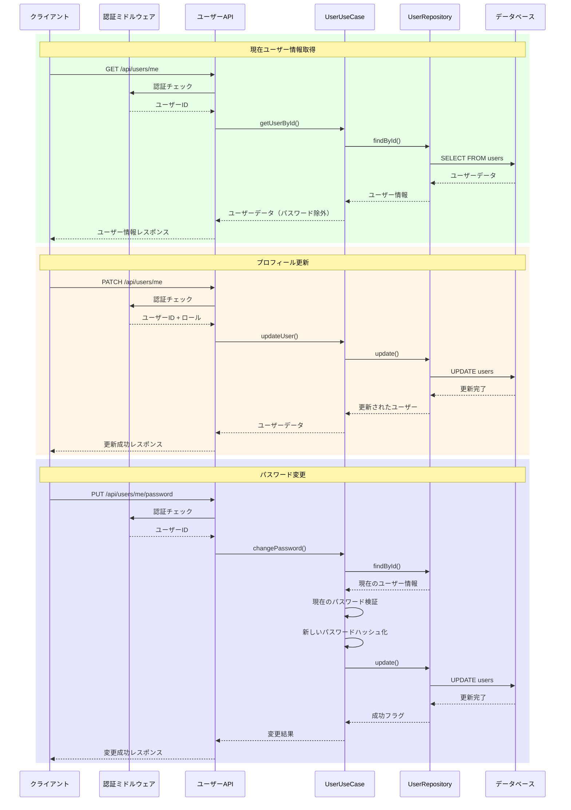
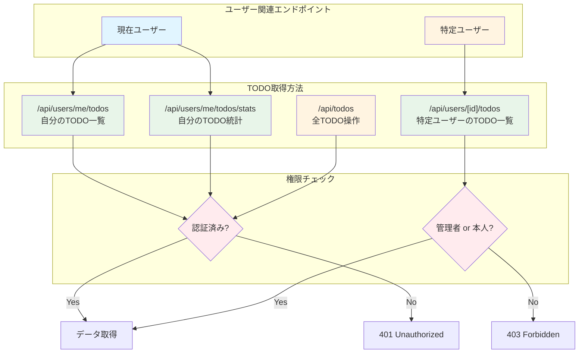
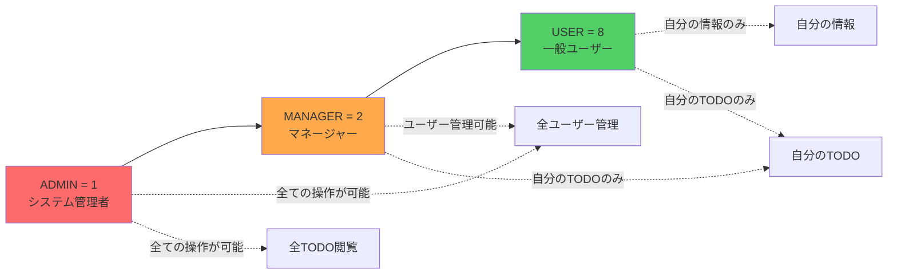
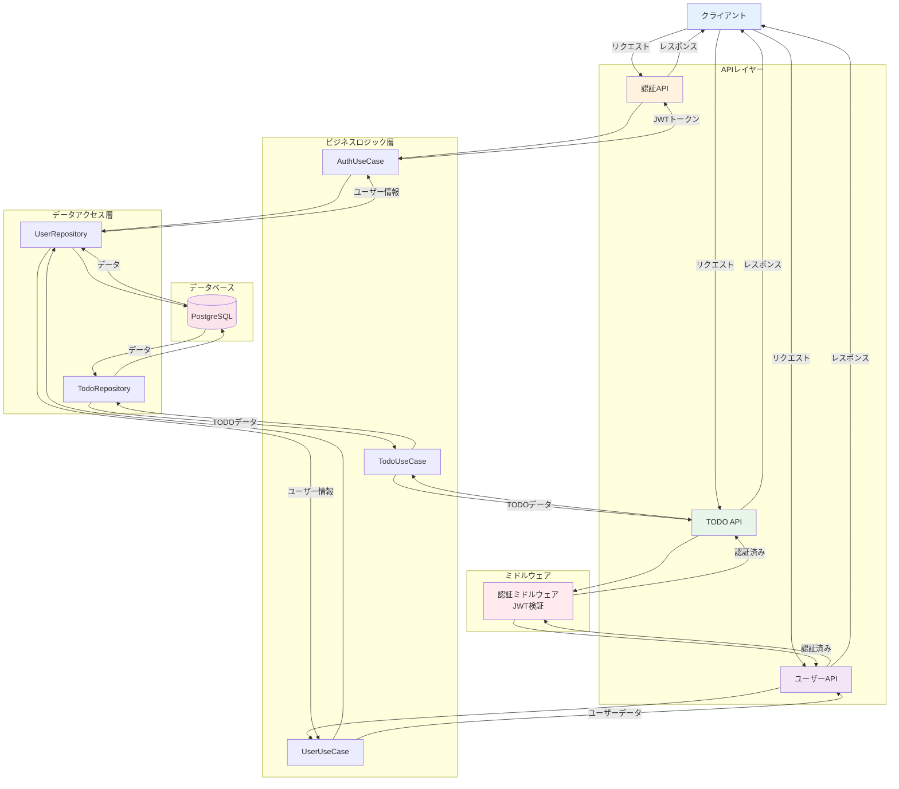
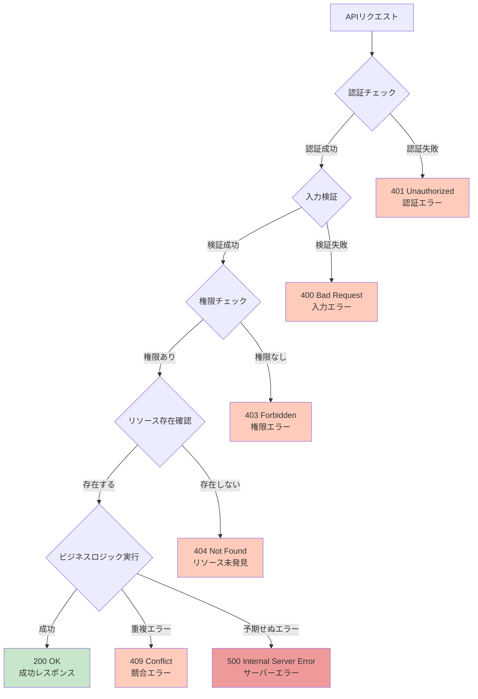

# APIエンドポイント フロー図

## 概要

このドキュメントでは、Next.js TODOアプリケーションのAPIエンドポイント構造とその関連性を図示します。

## 全体構造図

## 認証フロー

## TODO操作フロー

## ユーザー管理フロー

## ユーザーとTODOの関連フロー

## エンドポイント一覧表

### 認証エンドポイント

| メソッド | エンドポイント | 説明 | 認証 |
|---------|---------------|------|------|
| POST | `/api/auth/login` | ログイン | 不要 |
| POST | `/api/auth/register` | ユーザー登録 | 不要 |
| POST | `/api/auth/logout` | ログアウト | 不要 |

### TODOエンドポイント

| メソッド | エンドポイント | 説明 | 認証 | 権限 |
|---------|---------------|------|------|------|
| GET | `/api/todos` | TODO一覧取得（ページネーション、フィルタ、ソート対応） | 必要 | 本人のみ |
| POST | `/api/todos` | TODO作成 | 必要 | - |
| GET | `/api/todos/[id]` | TODO詳細取得 | 必要 | 本人のみ |
| PUT | `/api/todos/[id]` | TODO更新 | 必要 | 本人のみ |
| DELETE | `/api/todos/[id]` | TODO削除 | 必要 | 本人のみ |

### ユーザーエンドポイント

| メソッド | エンドポイント | 説明 | 認証 | 権限 |
|---------|---------------|------|------|------|
| GET | `/api/users` | ユーザー一覧取得 | 必要 | 管理者/マネージャー |
| POST | `/api/users` | ユーザー作成 | 必要 | 管理者/マネージャー |
| GET | `/api/users/[id]` | ユーザー詳細取得 | 必要 | 管理者/マネージャー or 本人 |
| PATCH | `/api/users/[id]` | ユーザー情報更新 | 必要 | 管理者/マネージャー or 本人 |
| DELETE | `/api/users/[id]` | ユーザー削除 | 必要 | 管理者/マネージャー |
| GET | `/api/users/[id]/todos` | 特定ユーザーのTODO一覧 | 必要 | 管理者 or 本人 |

### 現在ユーザーエンドポイント

| メソッド | エンドポイント | 説明 | 認証 | 権限 |
|---------|---------------|------|------|------|
| GET | `/api/users/me` | 自分の情報取得 | 必要 | - |
| PATCH | `/api/users/me` | 自分の情報更新 | 必要 | - |
| PUT | `/api/users/me/password` | パスワード変更 | 必要 | - |
| GET | `/api/users/me/todos` | 自分のTODO一覧 | 必要 | - |
| GET | `/api/users/me/todos/stats` | 自分のTODO統計 | 必要 | - |

### その他

| メソッド | エンドポイント | 説明 | 認証 |
|---------|---------------|------|------|
| GET | `/api/health` | ヘルスチェック | 不要 |

## 権限レベル

## データフロー概要

## エラーハンドリングフロー

## まとめ

このAPIは以下の特徴を持っています:

1. **RESTful設計**: リソース指向のURL設計とHTTPメソッドの適切な使用
2. **認証・認可**: JWT認証とロールベースアクセス制御（RBAC）
3. **階層的な権限管理**: ADMIN → MANAGER → USER の3段階
4. **セキュアな設計**: パスワードのハッシュ化、所有権チェック、機密情報の除外
5. **包括的なエラーハンドリング**: 適切なHTTPステータスコードとエラーメッセージ
6. **ページネーション対応**: 大量データの効率的な取得
7. **フィルタリング・ソート機能**: 柔軟なデータ検索
8. **統計情報提供**: TODO完了率などのダッシュボード機能
