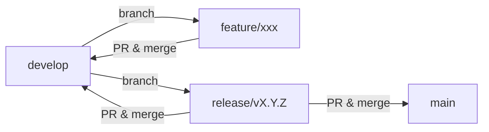
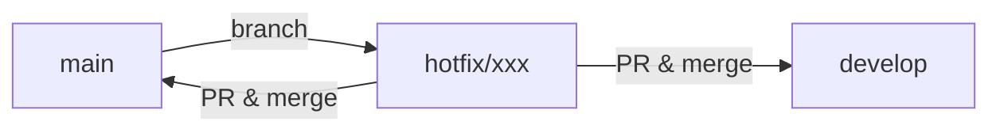
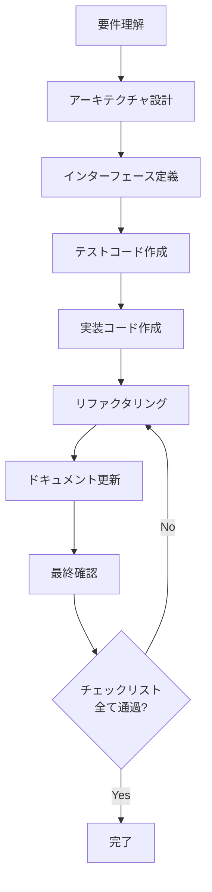

# AGENTS.md - AI エージェント開発ガイド

このドキュメントは、GitHub Copilot、Claude Code などの AI エージェントが、このプロジェクトで効率的かつ包括的な支援を提供するためのガイドラインです。

## 📋 目次

1. [基本方針](#基本方針)
2. [コミュニケーション言語](#コミュニケーション言語)
3. [Git ブランチ戦略](#git-ブランチ戦略)
4. [Git コミットメッセージフォーマット](#git-コミットメッセージフォーマット)
5. [GitHub Issue フォーマット](#github-issue-フォーマット)
6. [GitHub Pull Request フォーマット](#github-pull-request-フォーマット)
7. [日時処理の必須ルール](#日時処理の必須ルール)
8. [プロジェクト固有のルール](#プロジェクト固有のルール)
9. [コード生成時の注意事項](#コード生成時の注意事項)

---

## 基本方針

### AI エージェントの役割

AI エージェントは以下の役割を担います:

- コード実装の提案と生成
- テストコードの作成（99.5%以上のカバレッジ維持）
- コードレビューと品質改善の提案
- ドキュメントの作成と更新
- バグ修正と機能追加の支援
- リファクタリングの提案

### 品質基準

- **テストカバレッジ**: 99%以上を維持
- **型安全性**: TypeScript の厳密な型チェックに準拠
- **コード品質**: Biome によるリント・フォーマットに準拠
- **アーキテクチャ**: クリーンアーキテクチャの原則を遵守

---

## コミュニケーション言語

### 必須事項

**すべての AI エージェントとのやり取りは日本語で行うこと**

- プロンプトへの回答: 日本語
- コミットメッセージ: 日本語
- Issue の作成: 日本語
- Pull Request の説明: 日本語
- コードコメント: 日本語（JSDoc含む）
- ドキュメント: 日本語
- エラーメッセージ（可能な限り）: 日本語

### 例外

以下は英語を使用してもよい:

- 変数名、関数名、クラス名（camelCase/PascalCase）
- ライブラリ・フレームワークの固有名詞
- 技術用語（TypeScript、React、Next.js など）
- パッケージ名

---

## Git ブランチ戦略

このプロジェクトは **Git Flow** を採用しています。

### ブランチの種類

#### 1. メインブランチ

| ブランチ名 | 目的 | 保護 | マージ方法 |
|-----------|------|------|----------|
| `main` | 本番環境のコード | 🔒 保護あり | PR のみ |
| `develop` | 開発中のコード統合 | 🔒 保護あり | PR のみ |

#### 2. 作業ブランチ

| プレフィックス | 目的 | 例 | 派生元 | マージ先 |
|---------------|------|----|----|-------|
| `feature/` | 新機能開発 | `feature/todo-search` | `develop` | `develop` |
| `bugfix/` | バグ修正 | `bugfix/fix-auth-error` | `develop` | `develop` |
| `hotfix/` | 緊急修正 | `hotfix/security-patch` | `main` | `main` & `develop` |
| `release/` | リリース準備 | `release/v1.2.0` | `develop` | `main` & `develop` |
| `chore/` | 雑務（設定変更等） | `chore/update-deps` | `develop` | `develop` |
| `docs/` | ドキュメント更新 | `docs/update-readme` | `develop` | `develop` |
| `test/` | テスト追加・修正 | `test/add-user-tests` | `develop` | `develop` |
| `refactor/` | リファクタリング | `refactor/clean-usecase` | `develop` | `develop` |

### ブランチ命名規則

```
<type>/<short-description>

例:
✅ feature/todo-pagination
✅ bugfix/fix-jwt-expiry
✅ hotfix/security-vulnerability
✅ refactor/improve-error-handling
```

**ルール**:
- すべて小文字
- 単語の区切りは `-`（ハイフン）
- 簡潔で内容が分かる名前
- Issue 番号を含める場合: `feature/123-todo-search`

### ブランチ作成フロー

```bash
# 新機能開発
git checkout develop
git pull origin develop
git checkout -b feature/todo-search

# バグ修正
git checkout develop
git pull origin develop
git checkout -b bugfix/fix-auth-error

# 緊急修正（本番環境）
git checkout main
git pull origin main
git checkout -b hotfix/security-patch
```

### マージフロー

#### 通常の開発フロー



#### ホットフィックスフロー



### ブランチ削除ルール

- マージ完了後、作業ブランチは削除する
- GitHub の設定で自動削除を推奨
- `main` と `develop` は削除禁止

---

## Git コミットメッセージフォーマット

### 基本フォーマット

```
<type>: <subject>

<body>

<footer>
```

### Type（必須）

| Type | 説明 | 例 |
|------|------|-----|
| `feat` | 新機能追加 | `feat: Todo検索機能を追加` |
| `fix` | バグ修正 | `fix: JWT有効期限チェックの不具合を修正` |
| `docs` | ドキュメント変更 | `docs: READMEにAPI仕様を追加` |
| `style` | コードスタイル変更 | `style: Biomeフォーマットを適用` |
| `refactor` | リファクタリング | `refactor: TodoUseCaseを最適化` |
| `test` | テスト追加・修正 | `test: AuthUseCaseのテストを追加` |
| `chore` | ビルド・設定変更 | `chore: package.jsonを更新` |
| `perf` | パフォーマンス改善 | `perf: データベースクエリを最適化` |
| `ci` | CI/CD設定変更 | `ci: GitHub Actionsワークフローを追加` |
| `revert` | コミット取り消し | `revert: "feat: Todo検索機能を追加"` |

### Subject（必須）

- **日本語で記述**
- 50文字以内
- 末尾にピリオドを付けない
- 命令形で記述（「追加する」ではなく「追加」）

### Body（任意）

- **日本語で記述**
- 72文字で改行
- 変更内容の詳細を記述
- なぜこの変更が必要かを説明

### Footer（任意）

- **日本語で記述**
- Issue番号の参照: `Refs: #123`
- Issue のクローズ: `Closes: #123`
- 破壊的変更: `BREAKING CHANGE: 説明`

### コミットメッセージの例

#### 例1: 新機能追加

```
feat: Todo一覧にページネーション機能を追加

- 1ページあたり10件表示
- ページ番号とページサイズをクエリパラメータで指定可能
- 総件数とページ情報をレスポンスに含める

Refs: #42
```

#### 例2: バグ修正

```
fix: JWT有効期限チェックの不具合を修正

JWTトークンの有効期限が正しくチェックされていなかった問題を修正。
date-fnsを使用してJSTで時刻比較を行うように変更。

Closes: #58
```

#### 例3: リファクタリング

```
refactor: TodoUseCaseのエラーハンドリングを改善

- カスタムエラークラスを導入
- エラーメッセージを統一
- エラーログの出力を追加

テストカバレッジは99.5%を維持。
```

#### 例4: テスト追加

```
test: UserUseCaseのテストケースを追加

以下のエッジケースに対するテストを追加:
- ユーザー名重複時の処理
- 不正なロール値の処理
- パスワード変更時の検証

カバレッジが98%から100%に向上。
```

#### 例5: ドキュメント更新

```
docs: API仕様書にエラーレスポンス例を追加

各エンドポイントのエラーレスポンス例を追加。
HTTPステータスコードとエラーメッセージの対応表を記載。
```

### コミット粒度

- **1コミット = 1つの論理的な変更**
- 複数の変更を含める場合は、関連性のあるものに限定
- WIP（Work In Progress）コミットは避ける
- コミット前に必ずテストを実行し、成功を確認

---

## GitHub Issue フォーマット

### Issue タイトル

```
[<ラベル>] <簡潔な説明>

例:
[Bug] JWT認証が正しく動作しない
[Feature] Todo検索機能の実装
[Enhancement] テストカバレッジの向上
[Documentation] API仕様書の更新
```

### Issue テンプレート

#### 1. バグ報告

```markdown
## 🐛 バグの説明

簡潔にバグの内容を説明してください。

## 📝 再現手順

1. '...' へ移動
2. '...' をクリック
3. '...' まで下にスクロール
4. エラーが発生

## 🔍 期待される動作

本来どのように動作すべきかを説明してください。

## 📸 スクリーンショット

該当する場合、スクリーンショットを追加してください。

## 🔧 環境情報

- OS: [例: Windows 11]
- ブラウザ: [例: Chrome 120]
- Node.js: [例: v20.19.9]
- Next.js: [例: 15.4.3]

## 📎 追加情報

その他、関連する情報があれば記載してください。
```

#### 2. 機能要求

```markdown
## 💡 機能の説明

実装したい機能を簡潔に説明してください。

## 🎯 目的

この機能が必要な理由を説明してください。

## 📋 実装内容

- [ ] タスク1の説明
- [ ] タスク2の説明
- [ ] タスク3の説明

## 🔧 技術仕様

- 使用する技術・ライブラリ
- API設計
- データベーススキーマの変更

## ✅ 完了条件

- [ ] 機能が正常に動作する
- [ ] テストカバレッジが99%以上
- [ ] ドキュメントが更新されている

## 📎 参考資料

関連するドキュメントやリンクがあれば記載してください。
```

#### 3. リファクタリング

```markdown
## 🔄 リファクタリングの目的

リファクタリングを行う理由を説明してください。

## 📝 対象コード

リファクタリング対象のファイル・モジュールを列挙してください。

## 🎯 改善内容

- パフォーマンスの向上
- コードの可読性向上
- 保守性の向上

## ✅ チェックリスト

- [ ] 既存の機能が正常に動作する
- [ ] テストが全て通過する
- [ ] テストカバレッジが低下していない
- [ ] パフォーマンスが改善されている
```

### Issue ラベル

| ラベル | 説明 | 色 |
|-------|------|-----|
| `bug` | バグ報告 | 🔴 赤 |
| `feature` | 新機能要求 | 🟢 緑 |
| `enhancement` | 既存機能の改善 | 🔵 青 |
| `documentation` | ドキュメント関連 | 📘 青 |
| `test` | テスト関連 | 🟡 黄 |
| `refactor` | リファクタリング | 🟣 紫 |
| `chore` | 雑務・設定変更 | ⚪ グレー |
| `security` | セキュリティ関連 | 🟠 オレンジ |
| `performance` | パフォーマンス改善 | 🟢 緑 |
| `question` | 質問・議論 | 🟡 黄 |
| `wontfix` | 対応しない | ⚪ グレー |
| `duplicate` | 重複 | ⚪ グレー |
| `priority: high` | 優先度: 高 | 🔴 赤 |
| `priority: medium` | 優先度: 中 | 🟡 黄 |
| `priority: low` | 優先度: 低 | 🔵 青 |

---

## GitHub Pull Request フォーマット

### PR タイトル

```
<type>: <簡潔な説明>

例:
feat: Todo検索機能を実装
fix: JWT有効期限チェックの不具合を修正
docs: API仕様書を更新
```

### PR テンプレート

```markdown
## 📝 概要

このPRの目的を簡潔に説明してください。

## 🔗 関連Issue

Closes #123
Refs #456

## 📋 変更内容

- [ ] 機能Aを追加
- [ ] バグBを修正
- [ ] テストCを追加
- [ ] ドキュメントDを更新

## 🔧 技術的な詳細

### 実装内容

- **ファイルA**: 機能Xを実装
- **ファイルB**: メソッドYを追加
- **ファイルC**: テストZを追加

### アーキテクチャへの影響

このPRがアーキテクチャに与える影響を説明してください。

## ✅ テスト

### テストカバレッジ

- **変更前**: 99.5%
- **変更後**: 99.6%

### テスト項目

- [ ] 単体テストが全て通過
- [ ] 統合テストが全て通過
- [ ] E2Eテストが全て通過（該当する場合）

### 動作確認

以下の環境で動作確認を実施:

- [ ] ローカル環境
- [ ] Docker環境
- [ ] CI/CD パイプライン

## 📸 スクリーンショット

該当する場合、スクリーンショットまたはGIFを追加してください。

## 🔍 レビューポイント

レビュアーに特に確認してほしいポイントを記載してください:

- ポイント1
- ポイント2
- ポイント3

## 📎 備考

その他、参考情報や注意事項があれば記載してください。

## ✅ チェックリスト

- [ ] コードはBiomeでフォーマットされている
- [ ] リントエラーがない
- [ ] 全てのテストが通過している
- [ ] テストカバレッジが99%以上
- [ ] ドキュメントが更新されている
- [ ] コミットメッセージが規約に準拠している
- [ ] 破壊的変更がある場合、BREAKING CHANGEを記載している
```

### PR レビュー基準

#### 必須チェック項目

- [ ] コードがクリーンアーキテクチャに準拠している
- [ ] 型安全性が確保されている
- [ ] テストカバレッジが99%以上
- [ ] Biomeのリント・フォーマットに準拠
- [ ] 日時処理がdate-fns + JSTで実装されている
- [ ] エラーハンドリングが適切
- [ ] セキュリティリスクがない

#### 推奨チェック項目

- コードの可読性
- パフォーマンスへの影響
- 保守性の高さ
- ドキュメントの充実度

### PR ラベル

| ラベル | 説明 |
|-------|------|
| `ready for review` | レビュー準備完了 |
| `work in progress` | 作業中 |
| `needs revision` | 修正が必要 |
| `approved` | 承認済み |
| `breaking change` | 破壊的変更を含む |
| `dependencies` | 依存関係の更新 |

---

## 日時処理の必須ルール

### 🚨 絶対に守るべきルール

**すべての日時オブジェクトに関する操作は、必ず `date-fns` を使用し、`JST`（日本標準時）で行うこと**

### date-fns の使用が必須な理由

1. **タイムゾーンの一貫性**: システム全体でJSTに統一
2. **予測可能な動作**: ネイティブDateオブジェクトの問題を回避
3. **テスト容易性**: モックやスタブが容易
4. **可読性**: 意図が明確なコード

### 禁止事項

❌ **絶対にやってはいけないこと**:

```typescript
// ❌ ネイティブのDateコンストラクタを直接使用
const now = new Date();

// ❌ Date.now()の使用
const timestamp = Date.now();

// ❌ JavaScriptの日時メソッドの直接使用
const year = new Date().getFullYear();

// ❌ タイムゾーンを考慮しない比較
const isAfter = date1 > date2;

// ❌ moment.js や day.js の使用
import moment from 'moment'; // NG
```

### 必須の実装パターン

✅ **正しい実装方法**:

```typescript
import { nowJST, toJST, fromISOStringToJST, dbNowJST, dbValueToJST } from '@/lib/date-utils';
import { format, addDays, subDays, isAfter, isBefore, differenceInDays } from 'date-fns';
import { ja } from 'date-fns/locale';

// ✅ 現在日時の取得
const now = nowJST();

// ✅ データベース保存用の日時
const createdAt = dbNowJST();
const updatedAt = dbNowJST();

// ✅ データベースから取得した値の変換
const dbDate = dbValueToJST(row.created_at);

// ✅ 日時のフォーマット
const formatted = format(nowJST(), 'yyyy-MM-dd HH:mm:ss', { locale: ja });

// ✅ 日時の加算・減算
const tomorrow = addDays(nowJST(), 1);
const yesterday = subDays(nowJST(), 1);

// ✅ 日時の比較
const isNewer = isAfter(date1, date2);
const isOlder = isBefore(date1, date2);

// ✅ 日時の差分計算
const daysDiff = differenceInDays(nowJST(), pastDate);
```

### date-utils.ts の使用例

#### 1. エンティティでの使用

```typescript
// src/domain/entities/Todo.ts
import { nowJST } from '@/lib/date-utils';

export class Todo {
  constructor(
    public readonly id: string,
    public readonly title: string,
    public readonly descriptions: string | null,
    public readonly userId: string,
    public readonly createdAt: Date = nowJST(),
    public readonly updatedAt: Date = nowJST(),
  ) {}
}
```

#### 2. リポジトリでの使用

```typescript
// src/infrastructure/repositories/PostgresTodoRepository.ts
import { dbNowJST, dbValueToJST } from '@/lib/date-utils';

export class PostgresTodoRepository implements TodoRepository {
  async create(todo: Todo): Promise<Todo> {
    const query = `
      INSERT INTO todos (id, title, descriptions, user_id, created_at, updated_at)
      VALUES ($1, $2, $3, $4, $5, $6)
      RETURNING *
    `;
    
    const values = [
      todo.id,
      todo.title,
      todo.descriptions,
      todo.userId,
      dbNowJST(), // ✅ JSTで保存
      dbNowJST(), // ✅ JSTで保存
    ];

    const result = await this.db.query(query, values);
    return this.mapRowToTodo(result.rows[0]);
  }

  private mapRowToTodo(row: any): Todo {
    return new Todo(
      row.id,
      row.title,
      row.descriptions,
      row.user_id,
      dbValueToJST(row.created_at)!, // ✅ JSTに変換
      dbValueToJST(row.updated_at)!, // ✅ JSTに変換
    );
  }
}
```

#### 3. ユースケースでの使用

```typescript
// src/usecases/TodoUseCase.ts
import { nowJST } from '@/lib/date-utils';
import { isAfter, subDays } from 'date-fns';

export class TodoUseCase {
  async getRecentTodos(userId: string, days: number = 7): Promise<Todo[]> {
    const todos = await this.todoRepository.findByUserId(userId);
    const cutoffDate = subDays(nowJST(), days); // ✅ date-fns使用
    
    return todos.filter(todo => 
      isAfter(todo.createdAt, cutoffDate) // ✅ date-fns使用
    );
  }
}
```

#### 4. API レスポンスでの使用

```typescript
// src/app/api/todos/route.ts
import { format } from 'date-fns';
import { ja } from 'date-fns/locale';

export async function GET(request: NextRequest) {
  const todos = await container.todoUseCase.findAll();
  
  // ✅ 日本語形式でフォーマット
  const formattedTodos = todos.map(todo => ({
    ...todo,
    createdAt: format(todo.createdAt, 'yyyy年MM月dd日 HH:mm:ss', { locale: ja }),
    updatedAt: format(todo.updatedAt, 'yyyy年MM月dd日 HH:mm:ss', { locale: ja }),
  }));
  
  return success(formattedTodos, 'Todos retrieved successfully');
}
```

### date-fns の主要関数

#### 日時の取得・変換

| 関数 | 説明 | 使用例 |
|-----|------|-------|
| `nowJST()` | 現在のJST日時 | `const now = nowJST()` |
| `toJST(date)` | 任意の日時をJSTに変換 | `const jst = toJST(utcDate)` |
| `dbNowJST()` | DB保存用JST日時 | `createdAt: dbNowJST()` |
| `dbValueToJST(value)` | DB取得値をJSTに変換 | `dbValueToJST(row.created_at)` |

#### 日時の操作

| 関数 | 説明 | 使用例 |
|-----|------|-------|
| `addDays(date, amount)` | 日数を加算 | `addDays(nowJST(), 7)` |
| `subDays(date, amount)` | 日数を減算 | `subDays(nowJST(), 1)` |
| `addHours(date, amount)` | 時間を加算 | `addHours(nowJST(), 3)` |
| `addMinutes(date, amount)` | 分を加算 | `addMinutes(nowJST(), 30)` |

#### 日時の比較

| 関数 | 説明 | 使用例 |
|-----|------|-------|
| `isAfter(date, dateToCompare)` | dateがdateToCompareより後か | `isAfter(date1, date2)` |
| `isBefore(date, dateToCompare)` | dateがdateToCompareより前か | `isBefore(date1, date2)` |
| `isEqual(date, dateToCompare)` | dateとdateToCompareが等しいか | `isEqual(date1, date2)` |
| `isWithinInterval(date, interval)` | dateが期間内か | `isWithinInterval(date, { start, end })` |

#### 日時の差分

| 関数 | 説明 | 使用例 |
|-----|------|-------|
| `differenceInDays(dateLeft, dateRight)` | 日数の差分 | `differenceInDays(nowJST(), pastDate)` |
| `differenceInHours(dateLeft, dateRight)` | 時間の差分 | `differenceInHours(nowJST(), pastDate)` |
| `differenceInMinutes(dateLeft, dateRight)` | 分の差分 | `differenceInMinutes(nowJST(), pastDate)` |

#### 日時のフォーマット

| 関数 | 説明 | 使用例 |
|-----|------|-------|
| `format(date, formatStr, options?)` | 日時を文字列に変換 | `format(nowJST(), 'yyyy-MM-dd', { locale: ja })` |

---

## プロジェクト固有のルール

### アーキテクチャ原則

#### 1. クリーンアーキテクチャの遵守

```
依存性の方向:
app/api → usecases → domain
features → usecases → domain
infrastructure → domain
lib → すべての層で利用可能
```

#### 2. レイヤーの責務

| レイヤー | 責務 | 禁止事項 |
|---------|------|---------|
| `domain/` | ビジネスルール、エンティティ | 外部ライブラリへの依存 |
| `usecases/` | アプリケーションロジック | データベースアクセス |
| `infrastructure/` | 外部依存の実装 | ビジネスロジックの記述 |
| `app/api/` | HTTPリクエスト処理 | ビジネスロジックの記述 |
| `features/` | UI コンポーネント | 直接的なデータベースアクセス |
| `lib/` | 共通ユーティリティ | 特定のビジネスロジック |

### テストの必須要件

#### カバレッジ要件

```typescript
// jest.config.ts
coverageThreshold: {
  global: {
    statements: 99,    // 99%以上
    branches: 95,      // 95%以上
    functions: 95,     // 95%以上
    lines: 99,         // 99%以上
  },
},
```

#### テストパターン

```typescript
describe('UseCase/Repository/API のテスト', () => {
  // 1. セットアップ
  let useCase: UseCase;
  let mockRepository: jest.Mocked<Repository>;

  beforeEach(() => {
    jest.clearAllMocks();
    mockRepository = createMockRepository();
    useCase = new UseCase(mockRepository);
  });

  // 2. 正常系テスト
  describe('正常系', () => {
    it('有効なデータで処理が成功する', async () => {
      // Arrange
      const input = { /* ... */ };
      const expected = { /* ... */ };
      mockRepository.method.mockResolvedValue(expected);

      // Act
      const result = await useCase.execute(input);

      // Assert
      expect(result).toEqual(expected);
      expect(mockRepository.method).toHaveBeenCalledWith(input);
    });
  });

  // 3. 異常系テスト
  describe('異常系', () => {
    it('不正なデータでエラーがスローされる', async () => {
      // Arrange
      const invalidInput = { /* ... */ };

      // Act & Assert
      await expect(useCase.execute(invalidInput)).rejects.toThrow('Expected error message');
    });
  });

  // 4. エッジケーステスト
  describe('エッジケース', () => {
    it('空の配列が返される', async () => {
      // ...
    });

    it('null値が適切に処理される', async () => {
      // ...
    });
  });
});
```

### Next.js 15 対応パターン

#### params の Promise 型対応

```typescript
// ❌ 古い書き方（Next.js 14以前）
export async function GET(
  request: NextRequest,
  { params }: { params: { id: string } }
) {
  const { id } = params; // TypeScriptエラー
}

// ✅ 新しい書き方（Next.js 15）
export async function GET(
  request: NextRequest,
  context: { params: Promise<{ id: string }> }
) {
  const params = await context.params;
  const { id } = params;
}
```

### バリデーション規約

#### Zod スキーマの定義

```typescript
// src/lib/validation.ts
import { z } from 'zod';

export const TodoSchema = z.object({
  title: z.string()
    .min(1, '必須項目です')
    .max(32, '32文字以内で入力してください'),
  descriptions: z.string()
    .max(128, '128文字以内で入力してください')
    .optional(),
});

// APIエンドポイントでの使用
const validationResult = TodoSchema.safeParse(body);
if (!validationResult.success) {
  return error('Validation failed', 400, validationResult.error.issues);
}
```

### エラーハンドリング規約

#### API エンドポイント

```typescript
import { success, error, notFound, unauthorized, internalError } from '@/lib/response';

export async function POST(request: NextRequest) {
  try {
    // 1. バリデーション
    const validationResult = Schema.safeParse(body);
    if (!validationResult.success) {
      return error('Validation failed', 400, validationResult.error.issues);
    }

    // 2. ビジネスロジック実行
    const result = await container.useCase.execute(validationResult.data);

    // 3. 成功レスポンス
    return success(result, 'Operation successful');
  } catch (err) {
    console.error('API Error:', err);
    
    // 4. エラーハンドリング
    if (err instanceof NotFoundError) {
      return notFound(err.message);
    }
    if (err instanceof UnauthorizedError) {
      return unauthorized(err.message);
    }
    if (err instanceof Error) {
      return error(err.message, 400);
    }
    
    return internalError();
  }
}
```

### 依存性注入（DI）パターン

```typescript
// src/lib/container.ts
export class Container {
  private static instance: Container;

  private constructor(
    public readonly todoRepository: TodoRepository,
    public readonly userRepository: UserRepository,
    public readonly todoUseCase: TodoUseCase,
    public readonly userUseCase: UserUseCase,
    public readonly authUseCase: AuthUseCase,
  ) {}

  public static getInstance(): Container {
    if (!Container.instance) {
      const db = createDatabaseConnection();
      const todoRepo = new PostgresTodoRepository(db);
      const userRepo = new PostgresUserRepository(db);
      
      Container.instance = new Container(
        todoRepo,
        userRepo,
        new TodoUseCase(todoRepo, userRepo),
        new UserUseCase(userRepo),
        new AuthUseCase(userRepo),
      );
    }
    return Container.instance;
  }
}

// 使用例
const container = Container.getInstance();
const todos = await container.todoUseCase.findAll();
```

---

## コード生成時の注意事項

### AI エージェントが実装を提案する際のチェックリスト

#### 1. アーキテクチャの確認

- [ ] クリーンアーキテクチャに準拠しているか
- [ ] 依存性の方向が正しいか
- [ ] 適切なレイヤーに配置されているか

#### 2. 型安全性の確認

- [ ] すべての関数・変数に型アノテーションがあるか
- [ ] `any` 型を使用していないか
- [ ] 適切な型推論が働いているか

#### 3. 日時処理の確認

- [ ] `date-fns` を使用しているか
- [ ] `nowJST()` などのユーティリティを使用しているか
- [ ] JSTで統一されているか

#### 4. テストの確認

- [ ] テストコードが同時に提供されているか
- [ ] 正常系・異常系・エッジケースをカバーしているか
- [ ] カバレッジが99%以上を維持しているか

#### 5. エラーハンドリングの確認

- [ ] 適切な例外処理があるか
- [ ] エラーメッセージが日本語で分かりやすいか
- [ ] ログ出力が適切に行われているか

#### 6. セキュリティの確認

- [ ] 認証・認可が適切に実装されているか
- [ ] SQLインジェクション対策がされているか
- [ ] XSS対策がされているか
- [ ] パスワードがハッシュ化されているか

#### 7. パフォーマンスの確認

- [ ] N+1問題が発生していないか
- [ ] 不要なデータベースクエリがないか
- [ ] 適切なインデックスが使用されているか

#### 8. ドキュメントの確認

- [ ] JSDocコメントが記載されているか
- [ ] 複雑なロジックに説明コメントがあるか
- [ ] READMEやAPI仕様書が更新されているか

### コード生成の推奨フロー



### 実装の優先順位

1. **型定義**: TypeScript インターフェース・型の定義
2. **テストコード**: テスト駆動開発（TDD）
3. **ドメイン層**: エンティティ・リポジトリインターフェース
4. **ユースケース層**: ビジネスロジック
5. **インフラストラクチャ層**: リポジトリ実装
6. **API層**: エンドポイント実装
7. **フィーチャー層**: UI コンポーネント
8. **ドキュメント**: README、API仕様書の更新

---

## 参考資料

### プロジェクト内ドキュメント

- [`CLAUDE.md`](./CLAUDE.md): Claude AI 開発ガイド（詳細な実装パターン）
- [`README.md`](./README.md): プロジェクト概要とセットアップ
- [`.docs/api/`](./.docs/api/): API仕様書
- [`.docs/system/`](./.docs/system/): システム設計ドキュメント

### 外部リソース

- [Next.js 15 Documentation](https://nextjs.org/docs)
- [TypeScript Handbook](https://www.typescriptlang.org/docs/)
- [date-fns Documentation](https://date-fns.org/docs/Getting-Started)
- [Zod Documentation](https://zod.dev/)
- [Jest Documentation](https://jestjs.io/docs/getting-started)
- [Clean Architecture](https://blog.cleancoder.com/uncle-bob/2012/08/13/the-clean-architecture.html)

---

## まとめ

このドキュメントは、AI エージェントがこのプロジェクトで効率的に作業するためのガイドラインです。

**重要なポイント**:

1. **日本語でコミュニケーション**: コミット、Issue、PR、コメントはすべて日本語
2. **Git Flow に従う**: ブランチ戦略とコミット規約を遵守
3. **date-fns を必ず使用**: 日時処理は date-fns + JST で統一
4. **クリーンアーキテクチャを維持**: 依存性の方向を守る
5. **テストカバレッジ99%以上**: テスト駆動開発を実践
6. **型安全性を確保**: TypeScript の厳密な型チェック
7. **セキュリティを最優先**: 認証・認可・バリデーションを徹底

AI エージェントは、このガイドラインに従って、高品質で保守性の高いコードを提供してください。

---

**最終更新**: 2025年10月24日  
**バージョン**: 1.0.0  
**メンテナー**: jugeeem
